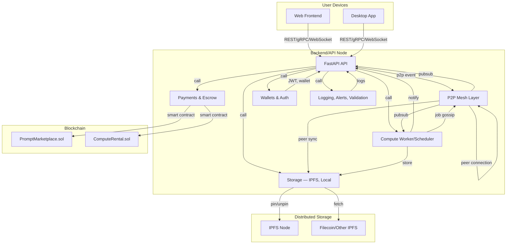
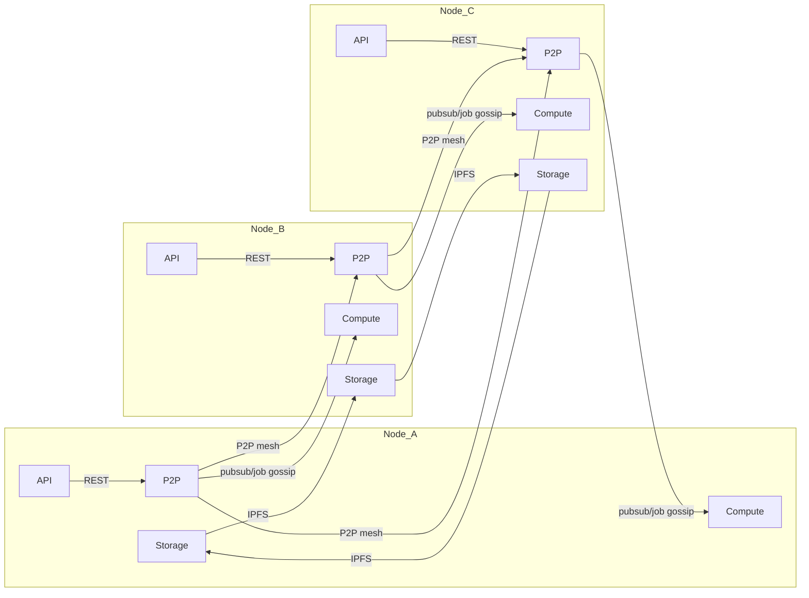
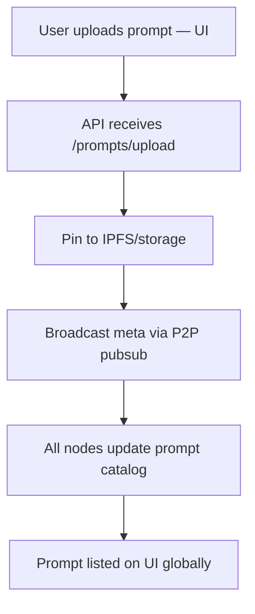
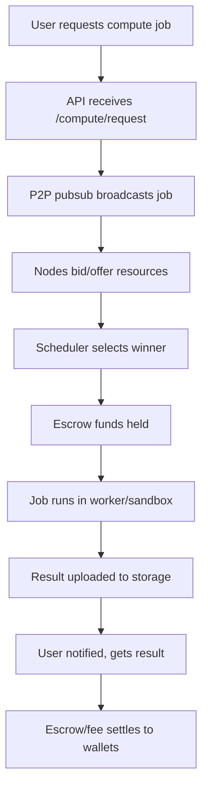
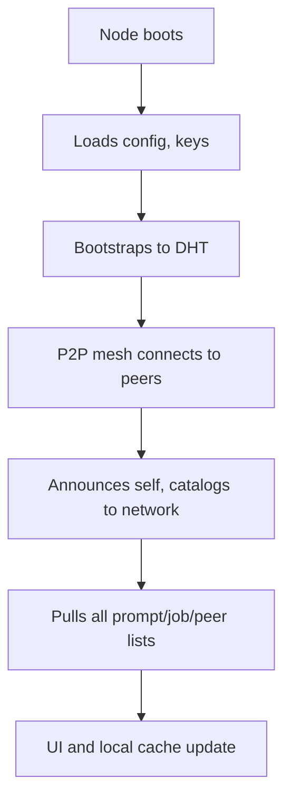
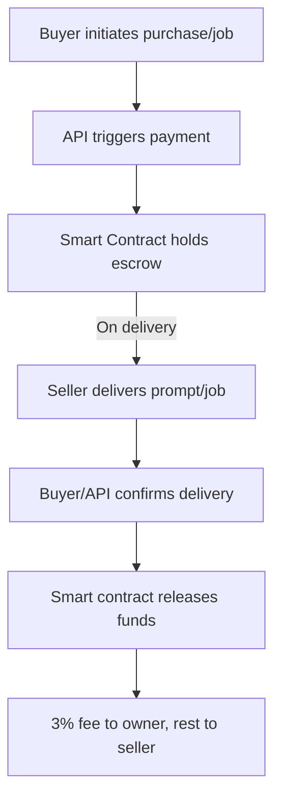
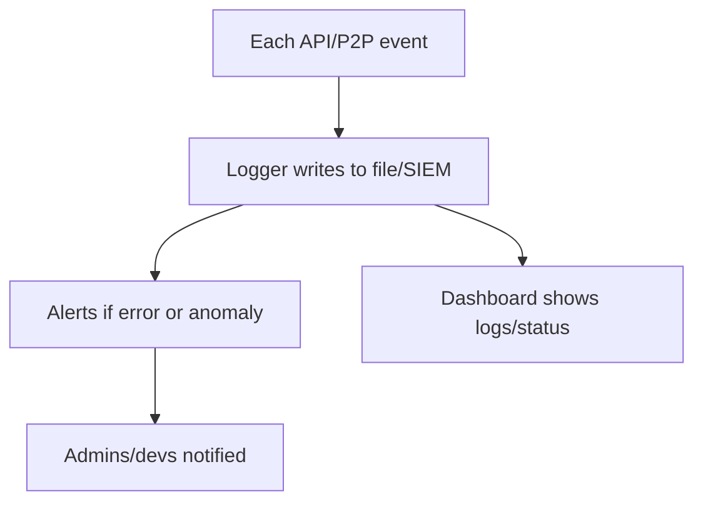
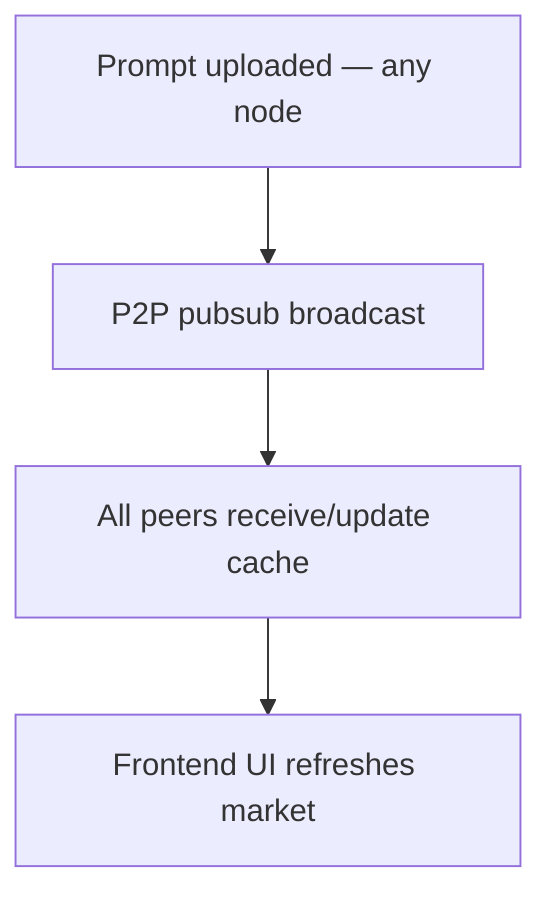

**A. Infra/Component Diagram: Full System**

⸻

**B. P2P Network Infra: Multi-node Overlay**

⸻

**C. Main Event Flowcharts (Process-Oriented)**

1. *Prompt Upload/Propagation*

⸻

2. *Compute Job Request, Bidding, Execution, Settlement*

⸻

3. *Node Startup/Discovery/Sync*

⸻

4. *Payment/Escrow/Settlement*

⸻

5. *Logging, Alerts, Monitoring*

⸻

**D. Real-Time Sync at a Glance**

