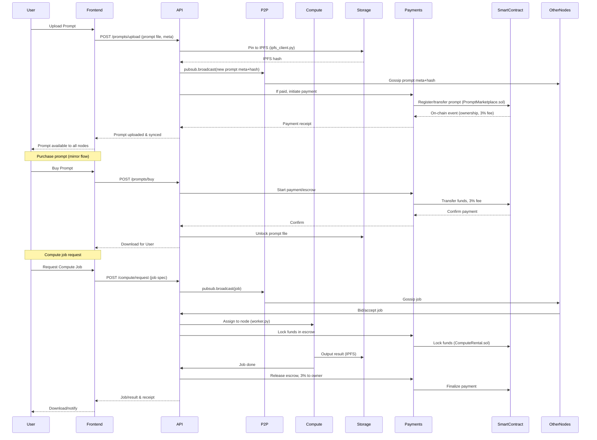
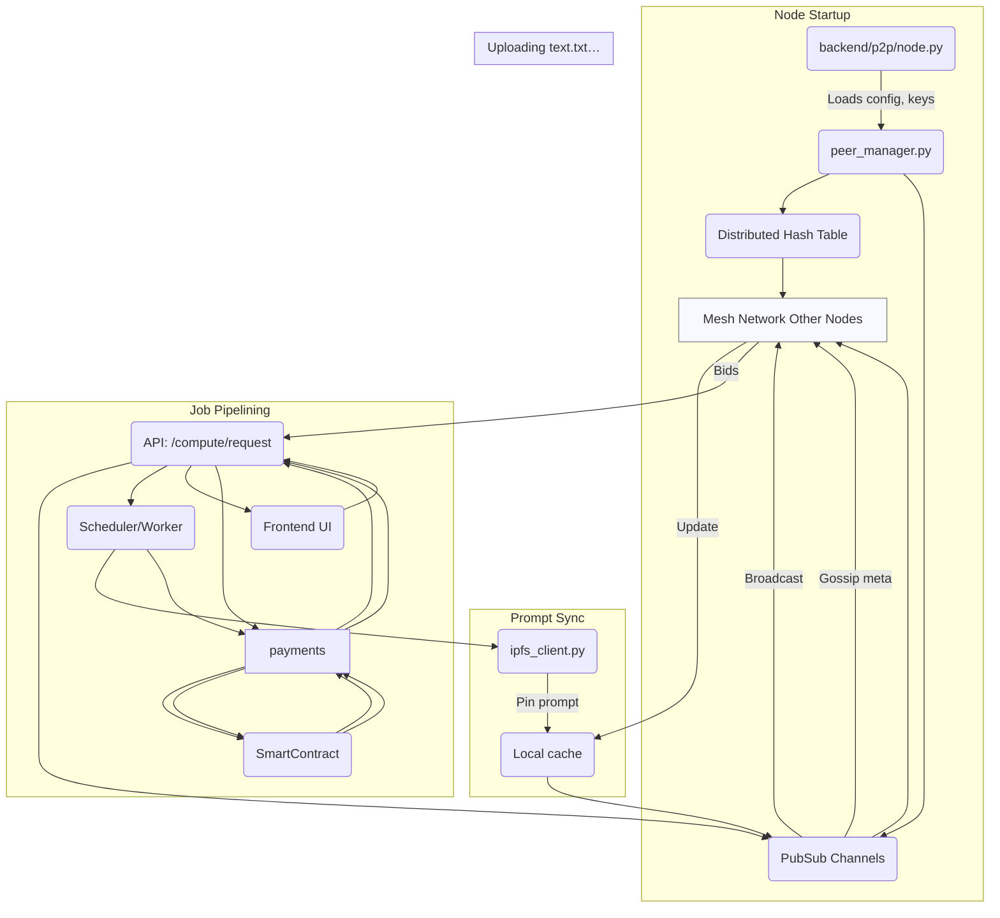
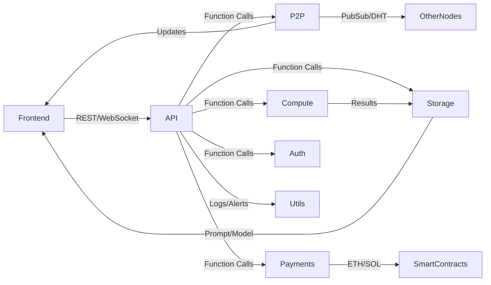
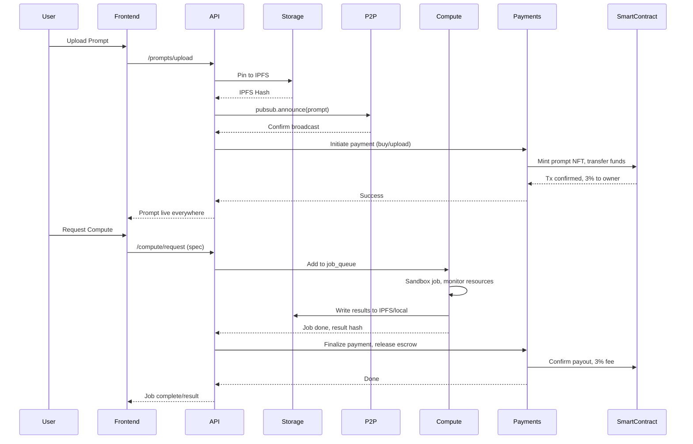
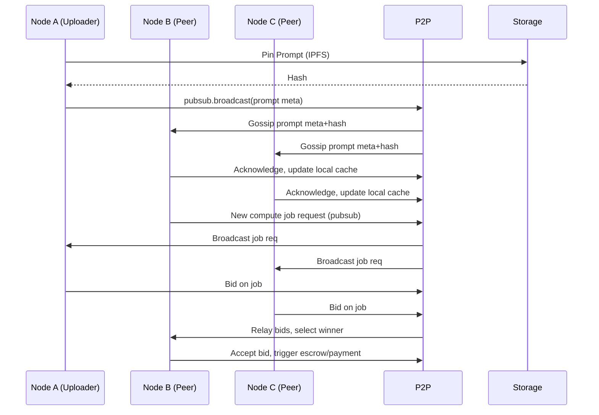
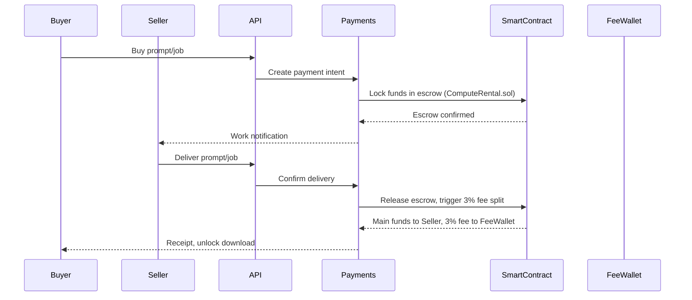
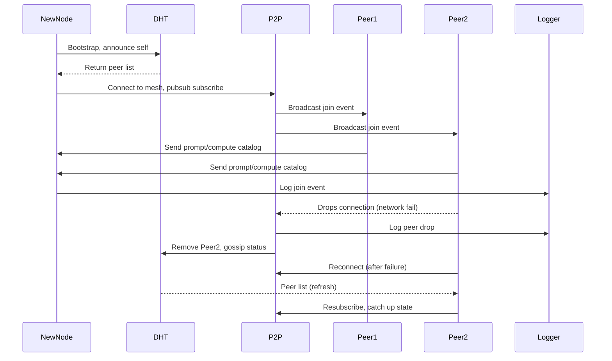
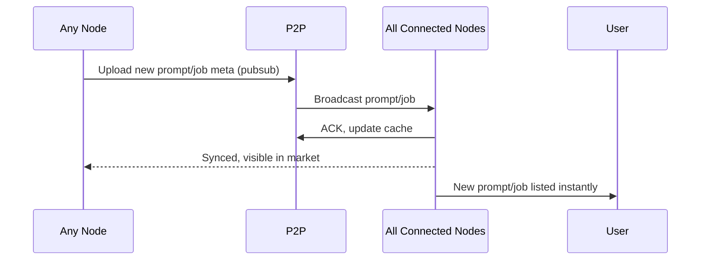

# Full System Alpha Pipe-Line

**1. High-Level Sequence:**

*Prompt Upload, Purchase, Compute Job*

⸻

**2. Network Auto-Discovery, Prompt Sync, Job Matching**

⸻

**3. System Component Interaction**

⸻

**4. Single Node Full Lifecycle**

*Prompt upload → job request → payment → receipt*

⸻

**5. Multi-Node Prompt/Job Sync**

*Prompt posted, all peers instantly see it, jobs distributed and bid upon*

⸻

**6. Payment/Escrow Lifecycle**

*Smart contract flow, including 3% fee skimming and escrow release*

⸻

**4. Node Join, Peer Discovery, Failure, and Recovery**

⸻

**5. Real-Time Prompt & Job Auto-Sync**

