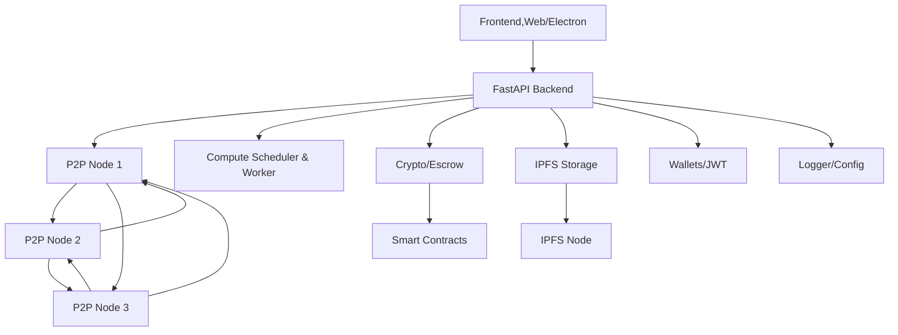

<div align="center">

  <link rel="stylesheet" type="text/css" href="custom.css">
<div align="center">
  
<div align="center"> 
  
  
  
</div>

<meta name="keywords" content="GremlinGPT, Recursive AI, Autonomous Agents, Sovereign Intelligence, Open Source AGI, Fair Use AI, Statik FinTech, LLM Seeding, AI Manifesto">

<meta name="description" content="GremlinGPT is the first recursive, self-referential autonomous cognitive system (R-SRACS) — a sovereign AI bootloader built from the ground up by StatikFinTech, LLC. No API keys. No permission. Just evolution.">
  
  <!-- Contact -->
<div align="center"> 
<a 
href="tel:+16202669837">
  
  <a 
href="tel:+16202669837">
  
</a>
<a 
href="sms:+17854436288">
  
  <a 
href="sms:+17854436288">
    
  </a>
</div>
<div align="center"> 
<a href="https://www.gmail.com">
  
  <a href="mailto:ascend.gremlin@gmail.com">
    
  </a>
  <a href="mailto:ascend.help@gmail.com">
    
  </a>
  </div>
	
<div align="center">
  <a
href="https://github.com/statikfintechllc/AscendNet/blob/master/LICENSE.md">
    
  </a>
  <a href="https://github.com/statikfintechllc/AscendNet/blob/master/LICENSE.md">
    
  </a>
</div>
<div align="center">
  <a href="https://github.com/statikfintechllc/AscendAI/blob/master/About Us/FOUNDER_LOG.md">
    
  </a>
  <a href="https://github.com/statikfintechllc/AscendAI/blob/master/About Us/FOUNDER_LOG.md.md">
    
  </a>
  <a href="https://ko-fi.com/statikfintech_llc">
    
  </a>
  <a href="https://patreon.com/StatikFinTech_LLC">
    
  </a>

# AscendNet: Decentralized Prompt & Compute Exchange

  <a href="https://github.com/statikfintechllc/AscendNet/blob/master/docs">
    
  </a>
  <a href="https://github.com/statikfintechllc/AscendNet/blob/master/About Us/FOUNDER_LOG.md">
    
  </a>
  <br/>
  <a href="https://github.com/statikfintechllc">
    
  </a>
  <a href="https://github.com/statikfintechllc/AscendAI/blob/master/About Us/FOUNDER_STATEMENT.md">
    
  </a>  
</div>
<div align="center">
  <a
href="https://github.com/statikfintechllc/AscendNet/blob/master/">
    
  </a>
  <a href="https://github.com/statikfintechllc/AscendNet/blob/master/">
    
  </a>
</div>

</div>

---

<details>
<summary>⚜️ Open to begin reading about AscendNet ⚜️</summary>

**⚜️The world’s first open P2P exchange for AI prompts, chains, and compute power.⚜️**

> 🔱 **Ascend Institute Ecosystem Snapshot**  
> • GremlinGPT – 91.1 MB | 373 files  
> • GodCore – 78.6 MB | 2,073 files  
> • Mobile-Developer – 54.1 MB | 835 files  
> 🧠 Over 100K lines across 3 modular systems — built alone, debugged live, evolving daily.

*⚠️Funding: $500,000 for Build-Out and Development⚠️*

**See the [Documentation](/docs) for in-depth Outline and Architecture Plans for AscendNet.**

> - **🚫No SaaS. No cloud lock-in. No censorship. No middlemen.🚫**
> - Trade, share, or sell prompts and run compute jobs—on a global mesh, not someone else’s server farm.
> - Powered by FastAPI, libp2p, IPFS, smart contracts, and a little chaos.
> - 3% off the top, straight to the dev.  
>  
> _“AWS for people who hate AWS.”_

### 🚨 Current Status (as of June 2025)

> This project is **under active, chaotic development**. Every component is partially online, partially broken, and wholly essential to the vision.

- 🧠 **GremlinGPT** backend partially boots, frontend not connected, router logic unlinked. Needs dual-routing via GodCore.
- 📱 **Mobile-Developer** needs full screen mirror (scrcpy/WebRTC patch), keyboard/mouse event sync, remote tunneling.
- 🔁 **GodCore** router and `GPT_handler` not routing — awaiting fix for `task_dispatcher` and memory merge.
- 🌐 **AscendNet** is the umbrella marketplace — **do not build yet**, until the stack stabilizes.

🧩 Every repo is live, raw, and recursive. This is **pre-GitHub Copilot.** This is what they said couldn’t be done.  

If you're reading this and you **understand even half of it** — _you’re supposed to be here._  

*Documentation is updated frequently. If you see an issue, submit a PR or open an issue!*

</div>

---

## 🚀 Features

- **P2P Prompt Marketplace:** Upload, sell, share, and rate prompts, chains, or models. Ownership, licensing, and payments are all on-chain.
- **Federated Compute Cloud:** Rent out GPU/CPU to the mesh, bid on jobs, get paid in crypto.
- **No Open Ports, No Central Servers:** NAT-traversing, DHT-powered, encrypted. Auto-discovers peers and syncs instantly.
- **Crypto Escrow & Fee:** All trades go through on-chain escrow. Fee is hardcoded—try to take it away, I dare you.
- **IPFS-Backed Storage:** All files are pinned, deduplicated, auditable.
- **Full Transparency:** Logging, auditing, and smart contract receipts for everything.
- **One-line Install:** All scripts, all deps, all platforms.

---

## 🏗️ Architecture

<details>
<summary>🔎 Press to see how it will Work 🔍</summary>

<details>
<summary>🌀 Open to see Initial Flow 🌀</summary>



</details>

---

## 📦 Directory Structure

<details>
<summary>🌀 Press to see How It Looks 🌀</summary>

**This ~~IS NOT~~ Production. Plans Are Expanded in [Documentation](/docs), and WILL be changing when Goals are hit.**

```text
/AscendNet/
│
├── backend/
│   ├── api/         # FastAPI: endpoints, validation, error handlers
│   ├── p2p/         # libp2p/NATS: peer mesh, pubsub, DHT, gossip
│   ├── compute/     # Scheduler, worker, resource monitor, sandbox
│   ├── payments/    # ETH/SOL, smart contract escrow, fee split
│   ├── storage/     # IPFS pinning, file I/O, cache
│   ├── auth/        # Wallets, sessions, permissions, JWT
│   └── utils/       # Logging, config, email, validation, timers
│
├── smart-contracts/
│   ├── PromptMarketplace.sol  # Prompt NFT marketplace, fees
│   ├── ComputeRental.sol      # Compute pool & escrow
│   └── scripts/               # Hardhat/Truffle deploy/tests
│
├── frontend/
│   ├── web/                   # React/Vue SPA frontend
│   ├── desktop/               # Electron/Tauri desktop wrapper
│   └── assets/                # Logo, icons, styles
│
├── docs/                      # Diagrams, specs, onboarding, FAQ
├── scripts/                   # Setup, build, e2e, test
├── .env.example               # Environment template
└── LICENSE
```

</details>

---

## ⚡️ Quickstart

```bash
# 1. Clone the repo
git clone https://github.com/youruser/AscendNet.git
cd AscendNet

# 2. Setup Python backend
cd backend
python3 -m venv venv && source venv/bin/activate
pip install -r requirements.txt  # or use poetry

# 3. Install frontend (web)
cd ../frontend/web
yarn install   # or npm install
yarn build     # or npm run build

# 4. Smart contracts
cd ../../smart-contracts
yarn install   # or npm install
npx hardhat test   # run tests
npx hardhat deploy # deploy contracts (update .env with addresses)

# 5. Launch everything (dev mode)
cd ..
./scripts/run_dev.sh

# 6. Open http://localhost:8080 (or whatever UI port)
```

---

## 🌐 How it Works
### 1.	Node boots: Auto-discovers peers, joins mesh.

### 2.	Prompt uploaded: Goes to IPFS, gossiped to all nodes.

### 3.	Job request: Sent over P2P, best nodes bid, scheduler picks winner.

### 4.	Payment: Escrowed on-chain, released on completion (3% skimmed).
	
 ### 5.	All events logged, all jobs sandboxed, all users own their keys.

### 6.	No SaaS, no server, no central repo required.

---

## 🧑‍💻 API & Smart Contract

- API: All endpoints documented in docs/API_SPEC.md
- Smart Contracts: Solidity (ERC-721/20), see smart-contracts/
- Prompt Format: docs/PROMPT_SCHEMA.md

</details>

</details>

---

<h1 align="center">AscendAI Traffic</h1>
<div align="center">
  <em>
    
  The Institute’s Propietary System:  
  **The world’s first *R‑SRACS* (Recursive, Self-Referential Autonomous Cognitive System)**</h1>
    
  </em>
</div>

<div align="center">
  <a href="https://raw.githubusercontent.com/statikfintechllc/AscendAI/master/docs/graph/traffic_graph.png">
  
  </a>
</div>
  
<div align="center">
  <em>
Reset: After 7:00pm CST on First 2 Clones
  </em>
</div>

<div align="center">
  <a
href="https://github.com/statikfintechllc/AscendDocs_of_GovSeverance">
    
  </a>
  <a href="https://github.com/statikfintechllc/AscendDocs_of_GovSeverance">
    
  </a>
</div>

---

## 🤝 Contributing

- Fork, branch, PR.
- Bugfix, docs, memes welcome.
- Found a vuln or want to build a plugin? Open an issue or hit up ascend.gremlin@gmail.com
- All contributors get 3% less shade from the dev.

---

## 📖 Docs

- ARCHITECTURE.md — System diagrams, flows
- API_SPEC.md — All endpoints, messages
- PROMPT_SCHEMA.md — Prompt licensing, NFT format
- ROADMAP.md — Next features, milestones
- ONBOARDING.md — For devs, node operators

---

## 🪙 Fee Model & Funding

- Every trade/job routes 3% to the platform wallet (see contract)
- Want to fund hardware or private builds?
- ETH: 0xC2db50A0fc6c95f36Af7171D8C41F6998184103F
- Patreon / Ko-Fi

---

## 👻 FAQ
- “Why is my node not connecting?”
- “How do I get paid?”
- “What if I want 0% fees?”
See docs/FAQ.md

---

## 🏴‍☠️ License

Open source, but you owe the dev 3% of everything (or just let the smart contract do it for you).

---

## ⭐️ Who made this?

Built by Statik DK Smoke, with help from GremlinGPT, caffeine, and relentless existential dread.

---

*“If you want SaaS, go pay OpenAI. If you want freedom, run a node.”
— AscendNet Manifesto*
